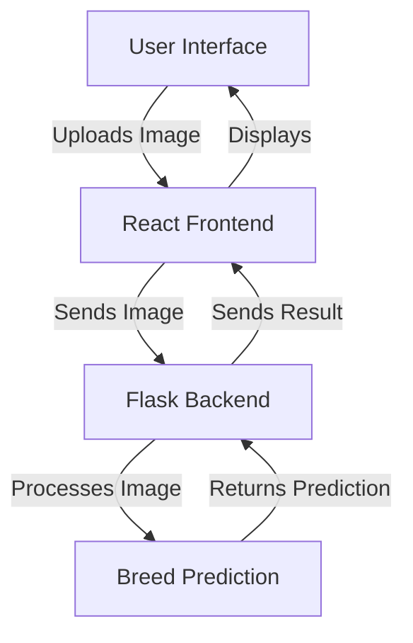

# 🐄 Cattle & Buffalo Breed Recognition System

An AI-powered prototype to identify Indian cattle and buffalo breeds from images. Built with a React frontend and a Flask backend.

## 📝 Overview
Accurate breed identification aids livestock management, conservation, dairy optimization, and veterinary research.

## ✨ Key Features
- Frontend (React + Tailwind)
  - Drag-and-drop upload with preview
  - Responsive, modern UI
  - Progress + loading states
  - Client-side validation and errors
- Backend (Flask)
  - Secure file validation and size limits
  - CORS configured for local dev
  - Health check endpoint
  - Structured logging

## 🏗 Architecture


## 🚀 Quick Start (Windows)

1) Backend setup
```powershell
cd "backend"
python -m venv venv
venv\Scripts\activate
pip install -r requirements.txt
python app.py
```

2) Frontend setup
```powershell
cd "frontend"
copy .env.example .env   # Adjust API URL if needed
npm install
npm start
```

3) Access
- Frontend: http://localhost:3000
- Backend API: http://127.0.0.1:5000
- Health Check: http://127.0.0.1:5000/health

## 📊 API Endpoints
- POST `/predict`
  - Body: FormData with `image`
  - Response: `{ breed, confidence, description, filename, size_bytes }`
- GET `/health`
  - Response: `{ status: "ok", message, time }`
- GET `/breeds`
  - Response: `{ breeds: string[] }`

## 🔒 Security & Validation
- File type and size validation (default 8 MB)
- Safe filename handling
- Image content verification with Pillow
- CORS limited to localhost dev by default

## 🔧 Configuration
- Backend: `backend/config.py`
  - `MAX_UPLOAD_MB` (env) default 8
  - `CORS_ORIGINS` (env) default `http://localhost:3000,http://127.0.0.1:3000`
- Frontend: `frontend/.env`
  - `REACT_APP_API_URL` default `http://127.0.0.1:5000`
  - `REACT_APP_DEBUG` default `true`

## 🐛 Troubleshooting
- CORS errors: ensure backend running and CORS origins allow your frontend origin
- File upload fails: check size/type and logs in `backend/logs/app.log`
- Frontend build errors: run `npm install` inside `frontend/`

## 📈 Future Enhancements
- Real ML model integration
- Batch uploads and export
- Auth + user profiles
- Offline support via service workers

## 📄 License
MIT License - See [LICENSE](LICENSE)

---
Developed with ❤ for the agricultural community
